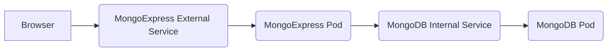

### Scope

- MongoDB pod
- MongoDB Internal Service
    - MongoDB is only accesible internally.
- MongoExpress deployment
    - Authenticate and connect to MongoDB
- Deployment
    - Contains specs and references to ConfigMap and Secret
- ConfigMap
    - Contains DB Url
- Secret 
    - Contains DB User and DB Pwd
- External Service 
    - To Connect externally
---
### Workflow


---
### Instructions

0. Check the cluster 
    - > kubectl get all 
1. Create `mongodb-deployment.yaml`
    - Check how to use (env variables etc) mongo container https://hub.docker.com/_/mongo
    - For the username-password we need to create a Secret
2. Create `mongodb-secret.yaml`
    - Reference the secrets in mongodb-deployment.yaml
3. Apply Secret
    - > kubectl apply -f mongodb-secret.yaml  
4. Apply mongoDB Deployment
    - > kubectl apply -f mongodb-deployment.yaml
5. Add Internal Service document into `mongodb-deployment.yaml`
    - It is possible to include multiple documents in same file, to seperate them use "---"
6. Apply Internal Service
    - > kubectl apply -f mongodb-deployment.yaml 
7. Create `mongo-express-deployment.yaml`
    - Check how to use (env variables etc) mongo container https://hub.docker.com/_/mongo-express
    - Set Secrets
8. Create `mongodb-configmap.yaml`
    - Reference the secrets in mongo-express-deployment.yaml
9. Apply ConfiMap
    - > kubectl apply -f mongodb-configmap.yaml
10. Apply mongo-express Deployment
    - > kubectl apply -f mongo-express-deployment.yaml
11. Add Internal Service document into `mongo-express-deployment.yaml`
12. Apply mongo-express-deployment
    - > kubectl apply -f mongo-express-deployment.yaml
13. Check the cluster 
    - > kubectl get all 
    - `service/mongo-express-service` has EXTERNAL-IP `<pending>` when in minicube. It is different then regular Kubenetes setup where you have public IP.
14. Assing IP to External Service
    - > minikube service mongo-express-service 
---
### Learning Notes

**How can I include multiple pods in a Service?**

A Service is used to expose a set of pods as a network service, and it provides a stable IP address and DNS name for accessing the pods. By default, a Service will load balance traffic to all pods that match its label selector.

To include multiple pods in a single Service, you can add the same label to all of the pods you want to include, and then use that label as the selector for the Service. For example, suppose

```
...
spec:
  selector:
    app: backend
    app: frontend
    ...
```

**How to make a Service External?**

Loadbalancer type assigns service an external IP address and so accepts external requests
nodePort is an external Port and it must be between 30000-32767

```
...
type: LoadBalancer
...
nodePort: 30000
...
```